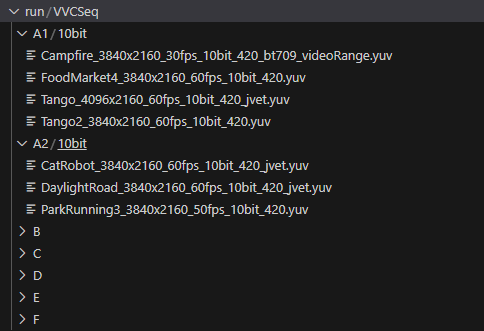
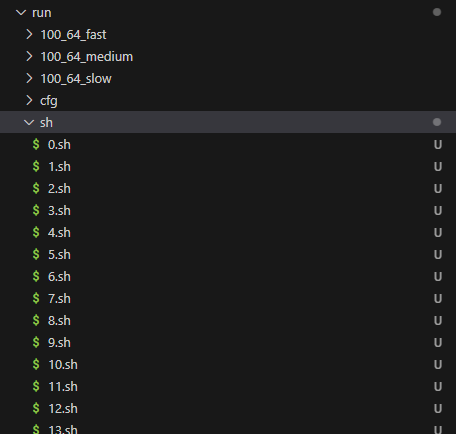

# MFLCNN-for-VVC
Fast Inter Partitioning method for VVC


### This is the demonstration program for the paper *Multi-Feature Lightweight CNN for Fast Inter CU Partitioning in Versatile Video Coding*. The project includes:

1.Modified code integrated with VTM 10.0;\
2.ONNX inference code for model deployment;\
3.Model weight files in ONNX format;\
4.Pre-compiled executables for rapid execution.

# How to run it
#### !The pre-build pragram can only run in Linux system.!


The pre-build pragram is in forder *./run/*  . Before we test the pragram, the CTC squence forder should be placed in this forder, the forder tree is as this:



Next, run the code to generate the shell script and the output forder
``` shell
cd run
python gen_sh.py 
```
We will get 300 script files in forder */sh* like this



We need to run these scripts one by one and wait for one or two days until they are all run. To speed up this process, we use a python thread manager to help us.

``` shell
python Thread_Mgr.py
```
This script will generate multiple threads to run the scripts in forder */sh/*, it can save our time. 

#### *But it should be noted that if the computer performance is not high enough and the number of programs running at the same time is too large, the programs may compete with each other for computer resources, and the encoding time will be inaccurate.*


To change the thread number generated in one time, we can modify the config file *Thread_Cfg.json* 
``` json
{
    "mem_threshold":"0.7",
    "max_thread":"1"
}
```
*mem_threshold* is used to check the memory space occupation of the computer. When the memory space occupation of the computer exceeds this value, no new thread will be allocated

*max_thread* is used to specify how many scripts the manager allows to run simultaneously. When a running script is completed, the manager will automatically start the next script

The training code will available soon.
